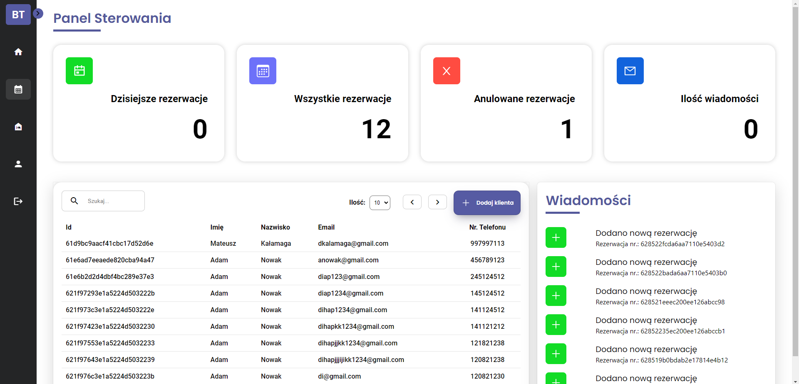
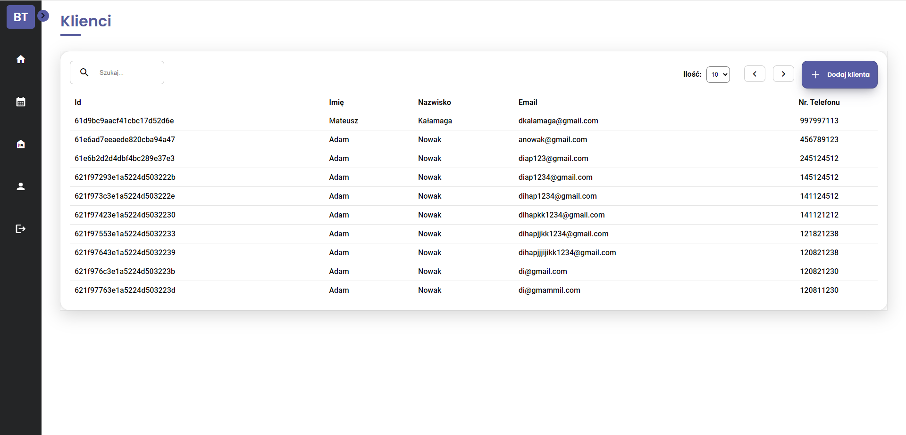
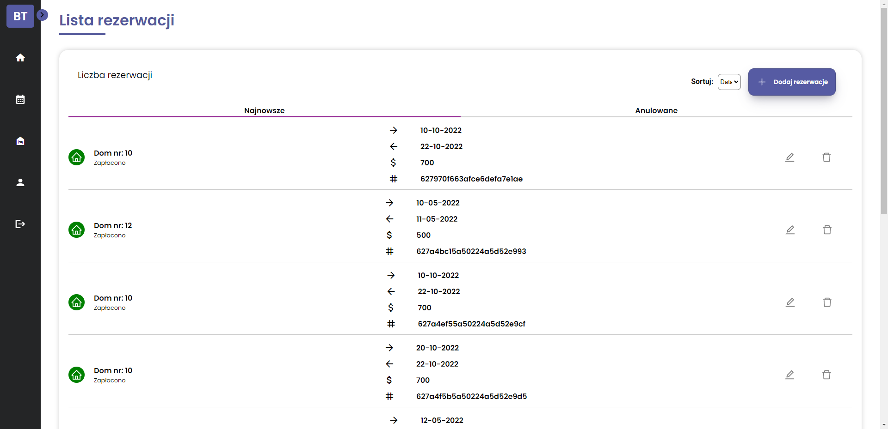
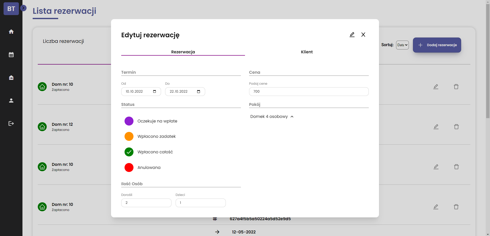
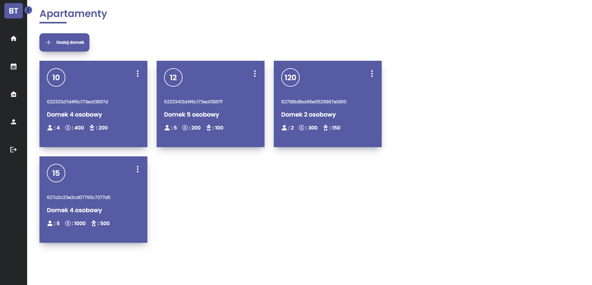
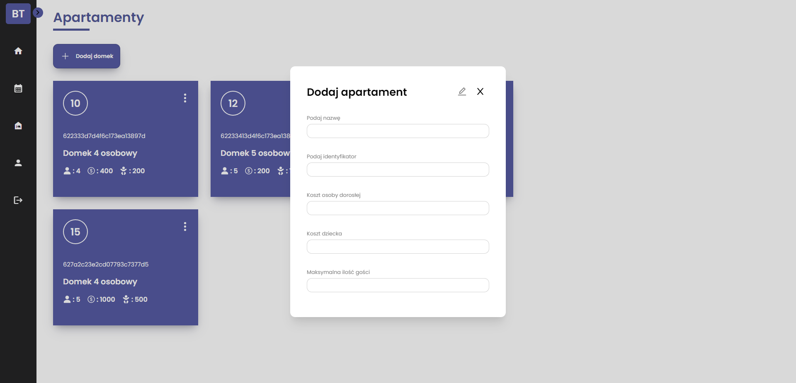

<div id="top"></div>


[![Contributors][contributors-shield]][contributors-url]
[![Forks][forks-shield]][forks-url]
[![Stargazers][stars-shield]][stars-url]
[![Issues][issues-shield]][issues-url]
[![MIT License][license-shield]][license-url]
[![LinkedIn][linkedin-shield]][linkedin-url]


<!-- PROJECT LOGO -->
<br />
<div align="center">
  <a href="https://github.com/ruckibartosz/BookTool">
    
  </a>

<h3 align="center">BookTool</h3>

  <p align="center">
    BookTool - free, open-source, web application to help you manage your hotel, agritourism or camping reservation. 
    <br />
    <a href="https://github.com/github_username/repo_name"><strong>Explore the docs »</strong></a>
    <br />
    <br />
    <a href="https://github.com/ruckibartosz/BookTool">View Demo</a>
    ·
    <a href="https://github.com/ruckibartosz/BookTool/issues">Report Bug</a>
    ·
    <a href="https://github.com/ruckibartosz/BookTool/issues">Request Feature</a>
  </p>
</div>


<!-- TABLE OF CONTENTS -->
<details>
  <summary>Table of Contents</summary>
  <ol>
    <li>
      <a href="#about-the-project">About The Project</a>
      <ul>
        <li><a href="#built-with">Built With</a></li>
      </ul>
    </li>
    <li>
      <a href="#getting-started">Getting Started</a>
      <ul>
        <li><a href="#prerequisites">Prerequisites</a></li>
        <li><a href="#installation">Installation</a></li>
      </ul>
    </li>
    <li><a href="#screenshots">Screenshots</a></li>
    <li><a href="#contributing">Contributing</a></li>
    <li><a href="#license">License</a></li>
    <li><a href="#contact">Contact</a></li> 
  </ol>
</details>


<!-- ABOUT THE PROJECT -->
## About The Project

[![Product Name Screen Shot][product-screenshot]](https://example.com)


BookTool is free, open-source, web application that consists of a few simple tools such as: booking list, customer and apartments database and all is synchronized at once, allows you to quickly and pleasantly manage small hotels and agritourism

<p align="right">(<a href="#top">back to top</a>)</p>


### Built With

* [React.js](https://reactjs.org/)
* [Redux](https://redux.js.org/)
* [Axios](https://github.com/axios/axios)
* [Node.js](https://nodejs.org/en/)
* [Express.js](https://expressjs.com/)
* [MongoDb](https://www.mongodb.com/)
* [MongoDb Atlas](https://www.mongodb.com/atlas/database)
* [Mongoose](https://mongoosejs.com/)
* [JWT](https://jwt.io/)


<p align="right">(<a href="#top">back to top</a>)</p>


<!-- GETTING STARTED -->
## Getting Started

To get a local copy up and running follow these simple steps.

### Prerequisites

Install latest version of npm
* npm
  ```sh
  npm install npm@latest -g
  ```

### Installation

1. Clone the repo
   ```sh
   git clone https://github.com/github_username/repo_name.git
   ```
2. Install NPM packages in `booktool-frontend` and `booktool-backend`
   ```sh
   npm install
   ```
3. Go to folder `booktool-backend` and create there `.env` file
4. In this file you have to provide 4 variables (PORT - application port, DATABASE - database url, SECRET_KEY - some generated string of characters, JWT_COOKIE_EXPIRES_IN - jwt cookie expires)
   ```sh
   PORT = 8000
   DATABASE = mongodb+srv://example:Example0123@!@cluster0.aacmd.mongodb.net/DatabaseName?retryWrites=true&w=majority
   SECRET_KEY = Li0Tde8HtGGNoGauPn5NeqngUUWni0sh
   JWT_COOKIE_EXPIRES_IN = 365d
   ```
  


<p align="right">(<a href="#top">back to top</a>)</p>


<!-- USAGE EXAMPLES -->
## Screenshots









<p align="right">(<a href="#top">back to top</a>)</p>


<!-- CONTRIBUTING -->
## Contributing

If you have a suggestion that would make this better, please fork the repo and create a pull request. You can also simply open an issue with the tag "enhancement".
Don't forget to give the project a star! Thanks again!

1. Fork the Project
2. Create your Feature Branch (`git checkout -b feature/AmazingFeature`)
3. Commit your Changes (`git commit -m 'Add some AmazingFeature'`)
4. Push to the Branch (`git push origin feature/AmazingFeature`)
5. Open a Pull Request

<p align="right">(<a href="#top">back to top</a>)</p>


<!-- LICENSE -->
## License

Distributed under the MIT License. See `LICENSE.txt` for more information.

<p align="right">(<a href="#top">back to top</a>)</p>


<!-- CONTACT -->
## Contact

 [@RuckiBartosz](https://twitter.com/RuckiBartosz) - ruckibartosz@gmail.com

Project Link: [https://github.com/ruckibartosz/ruckibartosz](https://github.com/ruckibartosz/BookTool)

<p align="right">(<a href="#top">back to top</a>)</p>


<!-- MARKDOWN LINKS & IMAGES -->
<!-- https://www.markdownguide.org/basic-syntax/#reference-style-links -->
[contributors-shield]: https://img.shields.io/github/contributors/ruckibartosz/BookTool.svg?style=for-the-badge
[contributors-url]: https://github.com/ruckibartosz/ruckibartosz/graphs/contributors
[forks-shield]: https://img.shields.io/github/forks/ruckibartosz/BookTool.svg?style=for-the-badge
[forks-url]: https://github.com/ruckibartosz/BookTool/network/members
[stars-shield]: https://img.shields.io/github/stars/ruckibartosz/BookTool.svg?style=for-the-badge
[stars-url]: https://github.com/ruckibartosz/BookTool/stargazers
[issues-shield]: https://img.shields.io/github/issues/ruckibartosz/BookTool.svg?style=for-the-badge
[issues-url]: https://github.com/ruckibartosz/BookTool/issues
[license-shield]: https://img.shields.io/github/license/ruckibartosz/BookTool.svg?style=for-the-badge
[license-url]: https://github.com/ruckibartosz/BookTool/blob/master/LICENSE.txt
[linkedin-shield]: https://img.shields.io/badge/-LinkedIn-black.svg?style=for-the-badge&logo=linkedin&colorB=555
[linkedin-url]: https://linkedin.com/in/ruckibartosz
[product-screenshot]: images/dashboard.png
